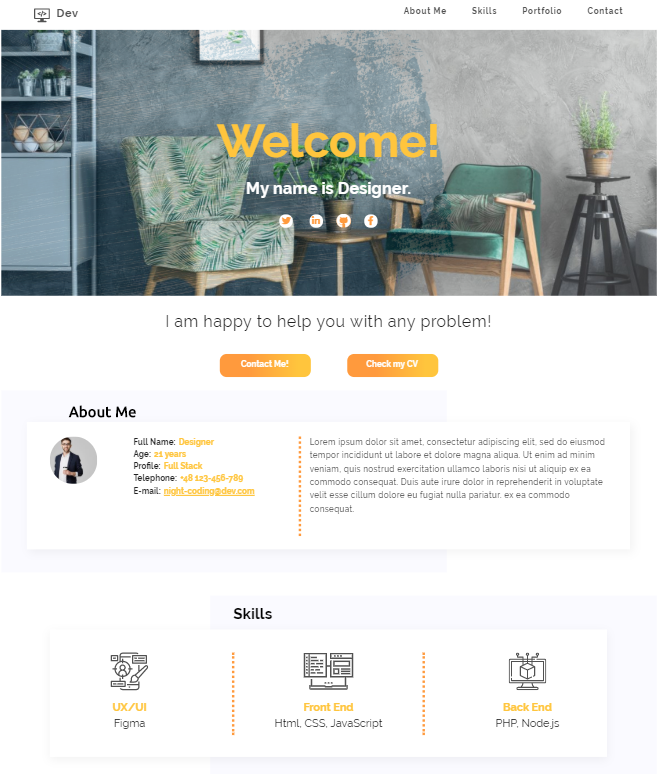

# Landing Page

Hi there!

 I created this page as a first individual project for CodersCamp course. It's a simple landing page based on a mockup.

No frameworks or libraries are used in this project - only HTML and CSS.  

**Link to live version on github pages:**

https://magdalenagrad.github.io/1-landing-page/

#### Technologies:

- HTML5
- CSS3

#### Preview:

  

## Thanks for visiting! 

